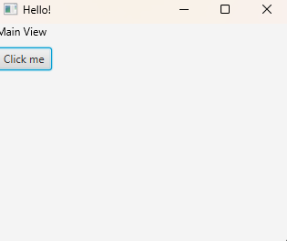

# View Components

This document will outline how to create FXML components, and how to add them to another FXML page. 

A file structure within the FXML folder has been established: /components/, which contains the FXML components, and /pages/ which contains the overarching pages. 
This allows us to create reusable components that are easily modifiable.

Let's say you have this page, and wanted to add a new component to it:



```fxml
<?xml version="1.0" encoding="UTF-8"?>

<?import javafx.scene.layout.VBox?>
<?import javafx.scene.control.Button?>
<?import javafx.scene.text.Text?>

<VBox xmlns:fx="http://javafx.com/fxml" spacing="10">
    <Text text="Main View" />
    <Button text="Click me" />
</VBox>
```

To create a reusable component, we can simply create a regular FXML file, and place it inside the /fxml/components/ folder.

For example, this would be a reusable button with label:
```fxml
[file is named 'reusable-button.fxml']
<?xml version="1.0" encoding="UTF-8"?>

<?import javafx.scene.layout.VBox?>
<?import javafx.scene.control.Label?>
<?import javafx.scene.control.Button?>

<VBox xmlns:fx="http://javafx.com/fxml">
    <Label text="I'm a reusable component!" />
    <Button text="Click me, I'm reusable!"  />
</VBox>
```

You would implement this into your page like so:

```fxml
<?xml version="1.0" encoding="UTF-8"?>

<?import javafx.scene.layout.VBox?>
<?import javafx.scene.control.Button?>
<?import javafx.scene.text.Text?>

<VBox xmlns:fx="http://javafx.com/fxml" spacing="10">
    <Text text="Main View" />
    <Button text="Click me" />
    
    <!-- This is the component -->
    <fx:include source="../components/reusable-button.fxml" />
</VBox>
```

and like magic, the component will now be loaded into the page:

